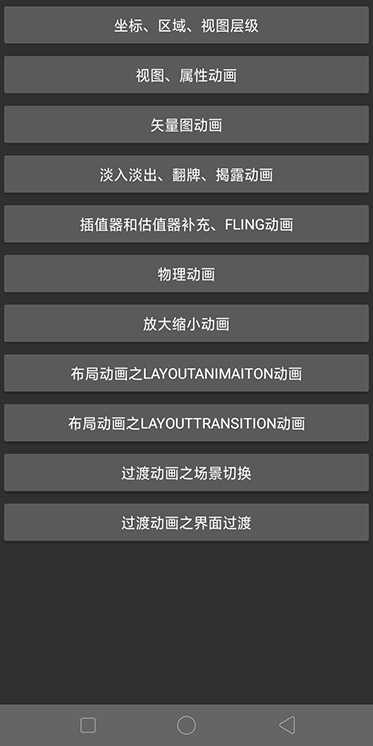

AnimationPracticeApplication
======

这是一个练习 Android 动画的项目，实现了 [官方文档][1] 的所有动画效果，同时附加了一些平时可能会遇到但不常用的动画效果。下面是 Demo 中每个动画效果的实现文档或相关知识点的记录文档：

[Android动画（一）：坐标、区域、视图层级][2]

[Android动画（二）：视图动画、属性动画][3]

[Android动画（三）：矢量图动画][4]

[Android动画（四）：淡入淡出、翻牌、揭露动画][5]

[Android动画（五）：插值器和估值器补充、Fling动画、物理动画][6]

[Android动画（六）：布局动画][7]

[Android动画（七）：过渡动画][8]

Demo截图：

### 鸣谢：

学习过程中，参考了网上很多优秀的文章，再结合自己的一些愚见，才有了这个练习项目。对于项目文档中所提的知识点或参考链接，笔者都是经过实际验证过其正确性才写出来的，带有疑惑的地方也有标注。最后，再次感谢这些写出优秀文章的前辈们，大部分知识点出处在文档中都有标注。

[1]: https://developer.android.com/training/animation
[2]: https://kimball325.github.io/2019/01/15/%E5%8A%A8%E7%94%BB%E5%9F%BA%E7%A1%8001%EF%BC%9A%E5%9D%90%E6%A0%87%E3%80%81%E5%8C%BA%E5%9F%9F%E3%80%81%E8%A7%86%E5%9B%BE%E5%B1%82%E7%BA%A7/
[3]: https://kimball325.github.io/2019/01/25/%E5%8A%A8%E7%94%BB%E5%9F%BA%E7%A1%8002%EF%BC%9A%E8%A7%86%E5%9B%BE%E5%8A%A8%E7%94%BB%E3%80%81%E5%B1%9E%E6%80%A7%E5%8A%A8%E7%94%BB/
[4]: https://kimball325.github.io/2019/02/17/%E5%8A%A8%E7%94%BB%E5%9F%BA%E7%A1%8003%EF%BC%9A%E7%9F%A2%E9%87%8F%E5%9B%BE%E5%8A%A8%E7%94%BB/
[5]: https://kimball325.github.io/2019/02/22/%E5%8A%A8%E7%94%BB%E5%9F%BA%E7%A1%8004%EF%BC%9A%E6%B7%A1%E5%85%A5%E3%80%81%E7%BF%BB%E7%89%8C%E3%80%81%E6%8F%AD%E9%9C%B2%E5%8A%A8%E7%94%BB/
[6]: https://kimball325.github.io/2019/03/03/%E5%8A%A8%E7%94%BB%E5%9F%BA%E7%A1%8005%EF%BC%9APath%E7%B1%BB%E5%9E%8B%E6%8F%92%E5%80%BC%E5%99%A8%E3%80%81%E8%B7%AF%E5%BE%84%E5%8A%A8%E7%94%BB%E3%80%81Fling%E5%8A%A8%E7%94%BB/
[7]: https://kimball325.github.io/2019/07/21/%E5%8A%A8%E7%94%BB%E5%9F%BA%E7%A1%8006%EF%BC%9A%E5%B8%83%E5%B1%80%E5%8A%A8%E7%94%BB/
[8]: https://kimball325.github.io/2019/07/29/%E8%BF%87%E6%B8%A1%E5%8A%A8%E7%94%BB/
